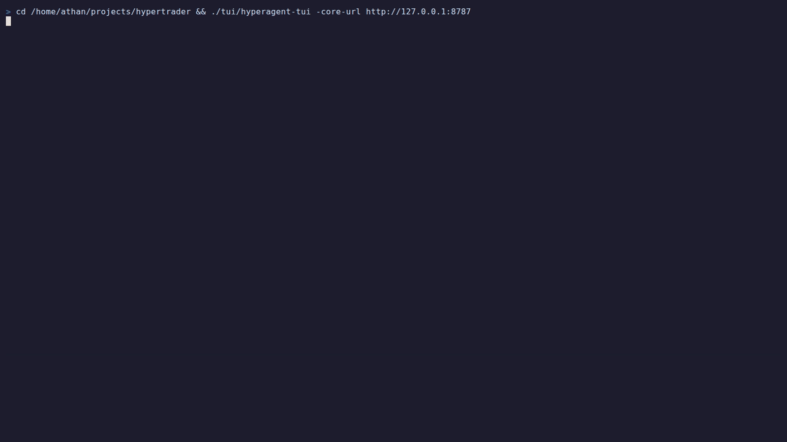

# Hyperion



*The cockpit end to end: connect to the daemon, watch the market picture and thesis cards fill in live, run `/help` `/watch add` `/tf`, flip propose ↔ autonomous mode, force a `/scan`, then ask the agent directly for a written read on BTC.*

Autonomous trading operator on Hyperliquid. Agents state a mandate in plain language — "reach 60/40 ETH–stablecoin, 90 days, max 8% drawdown" — and the system watches, reasons, and executes. Backend daemon ingests markets, runs reasoning loops via LLM agents, executes through hard-coded risk gates. Every decision journaled and inspectable.

## Architecture

**Full loop:** ingest → reason → execute → journal

- **Backend daemon** (:8787) — Market ingestion, position tracking, order execution, risk gates, event bus
- **MCP server** — Exposes Hyperliquid markets and trading as tools. Claude (or any MCP client) reads data and places orders through same risk gates as daemon
- **TUI cockpit** — Operator interface. Real-time feeds, watchlist, position view, order builder
- **Append-only journal** — Every candidate, thesis, and fill recorded. Proof layer for reputation

## Structure

```
backend/        Core daemon. HTTP+WS on :8787. Market data, execution, metrics.
tui/            Cockpit UI (Go + Lipgloss). Live feeds, position tracking, orders.
docs/           Architecture, YC application notes.
pitch/          Landing page, pitch deck, media.
```

## Quick Start

### Backend
```bash
cd backend
cp .env.example .env  # Set HL_AGENT_KEY, HL_ACCOUNT_KEY, etc.
./build.sh            # or: go build -o hyperagent ./src
./hyperagent -testnet  # daemon, propose mode, config.toml
```

Server runs on `http://localhost:8787`. MCP server on stdio (configure via Claude Code MCP settings).

### TUI
```bash
cd tui
go build -o hyperagent-tui ./src
./hyperagent-tui -core-url http://127.0.0.1:8787
```

Cockpit connects to backend over HTTP+WS. One screen, five panels (MANDATE · MARKET PICTURE · EXECUTION · THESES · DECISION JOURNAL) plus a chat bar — `/` opens it (swaps DECISION JOURNAL for the AGENT reply pane), `m` toggles propose/autonomous, `q` quits.

## Tech Stack

- **Backend:** Go, Echo (HTTP), WebSocket, Bubble Tea (MCP event handling)
- **Frontend:** Go, Lipgloss v2 (TUI rendering)
- **Reasoning:** Claude / OpenAI / Deepseek (via MCP tool calls)
- **Market Data:** Hyperliquid API (REST + WebSocket)
- **Signing:** Custom EIP-712 implementation, Hyperliquid reference vector verified
- **Metrics:** Prometheus-compatible endpoint

## Key Features

- **Mandate-driven interface** — Goal, horizon, risk envelope in one input
- **Deterministic execution** — Orders pass compiled risk gates before wire
- **Verifiable journal** — Append-only decision record, bit-exact EIP-712 sigs
- **Agent-native** — MCP protocol means Claude (or any LLM) can trade
- **Operator override** — Halt or veto at any time
- **Multi-model reasoning** — Pluggable LLM backends

## Development

Cockpit build complete: five-panel layout, live feeds, thesis cards, chat-driven slash commands, mode toggle. Current focus: thesis invalidation handling and execution-flow hardening.

## MCP Usage

Register the MCP server in Claude Code / Claude Desktop:

```bash
claude mcp add hyperion -- ./backend/hyperagent mcp -address 0xYourMasterAccount
```

Then use Claude with trading tools:

- `read_markets` — Get current order books, funding rates, recent trades
- `read_positions` — Account positions, P&L, exposure
- `place_order` — Submit limit/market orders through risk gates
- `cancel_order` — Cancel open orders

All operations go through the same executor and gates. Signing verified against Hyperliquid reference.
